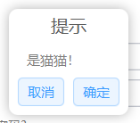
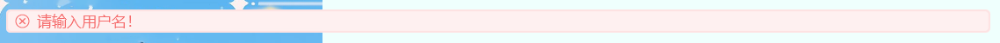

Click here to choose Language: [English](https://github.com/Anivie/CloudTools/blob/master/README_en.md) | 中文

# 关于项目：
一个JavaFx的工具包，本项目与[ElementFX](https://github.com/Anivie/ElementFX)互补。  

# 使用:
项目目前还没有上传到Maven中央仓库，您可以自行编译或者从Release中下载jar本地导入  

# 当前支持的特性:

## 更美观的信息框：
### 使用:
普通使用：``CloudMessageBox("提示","是猫猫！").showOnly()``



自定义按钮并获取返回值：
```kotlin
val buttons = arrayOf("红猫", "橙猫", "黄猫", "绿猫")
println(CloudMessageBox("提示", "选择一只属于你的猫猫吧！", button = buttons).showAndGet())//Out put 2 if press "黄猫"
```


## 漂浮提示框：  
用于浅打扰性的提示用户当前操作状态/结果,通过更改枚举类NoticeType切换提示主题色。
###使用:
```kotlin
CloudNotice(NoticeType.Right, "请输入用户名！", primaryStage).show()
```
拥有多个效果：




