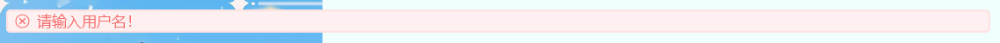

Click here to choose Language: English | [中文](https://github.com/Anivie/CloudTools/README.md)

# About：
A Java Fx toolkit, this project is related to[ElementFX](https://github.com/Anivie/ElementFX).

# Usage:
This project has not yet been uploaded to the Maven central repository, you can compile it yourself or download the jar from Release and import it locally

# Features:

## MessageBox：
### Usage:
Default：``CloudMessageBox("提示","是猫猫！").showOnly()``


If you want to target some button：
```kotlin
val buttons = arrayOf("红猫", "橙猫", "黄猫", "绿猫")
println(CloudMessageBox("提示", "选择一只属于你的猫猫吧！", button = buttons).showAndGet())//Out put 2 if click "黄猫"
```


## Notice
Is used for lightly intrusive prompting the user's current operation status or results, the prompt theme color can be switched by changing the enumeration class NoticeType.
### Usage:
```kotlin
CloudNotice(NoticeType.Right, "请输入用户名！", primaryStage).show()
```
Themes here：




